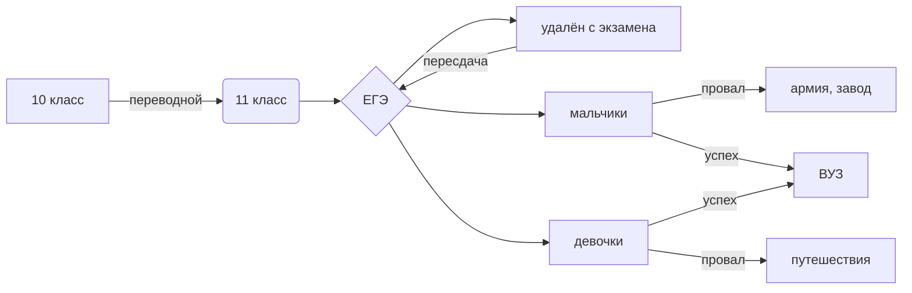
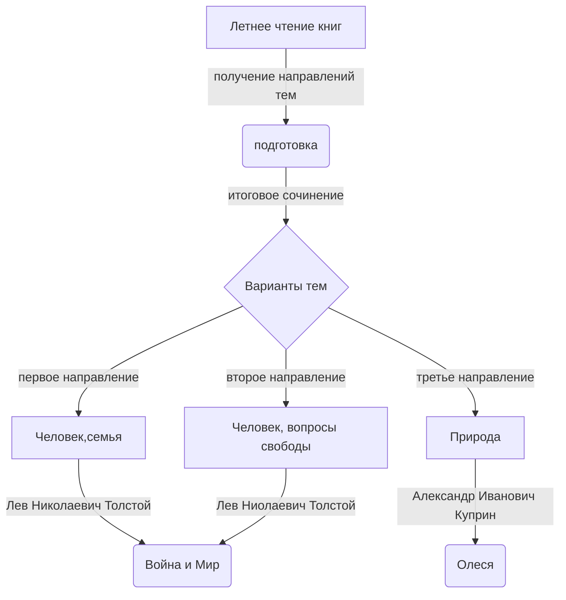

# Бричков Никита, 041 группа

## Краткое описание имеющихся файлов
- My Py notebook.ipynb - файл с теми программами на Python, что мне удалось вспомнить и осуществить на половине пары.
- comands in sql - файл с SQL командами, которые применяются для работы с базами данных
- dbsql_client_v0.1.exe - предлагаемая база данных учащихся ЛТПУ
- python шпора.ipynb.txt - крутая шпора по Python

Неравенство Бернулли

$$ (1 + x)^n \ge 1 + nx $$

Формула работы в изотермическом процессе

$$ A=\frac{m}{\mu}RTln\frac{P_1}{P_2} $$

Сумма моментов, действующих на рамку

$$ \sum M_i = IBSsin\alpha $$

<iframe width="768" height="432" src="https://miro.com/app/live-embed/uXjVPD1y1-g=/?moveToViewport=-7406,-2287,2190,1109&embedId=679918713050" frameborder="0" scrolling="no" allowfullscreen></iframe>

https://app.genial.ly/editor/63731ad8978d3400129beea0

<iframe title="Interactive image" frameborder="0" width="1200" height="674" style="position: absolute; top: 0; left: 0; width: 100%; height: 100%;" src="https://view.genial.ly/6378d7e28460fb0017c365a1" type="text/html" allowscriptaccess="always" allowfullscreen="true" scrolling="yes" allownetworking="all"></iframe> 
 

